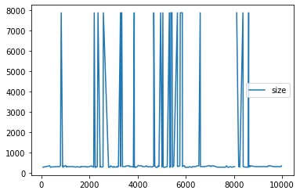

Lets`s read apache_logs  with known format. So, we can use regexp in separator


```python
import re
import pandas as pd

df = pd.read_csv(
    'apache_logs',
    sep=r'\s(?=(?:[^"]*"[^"]*")*[^"]*$)(?![^\[]*\])',
    engine='python',
    na_values='-',
    header=None,
    usecols=[0, 3, 4, 5, 6, 7, 8],
    names=['ip', 'time', 'request', 'status', 'size', 'referer', 'user_agent'])
```

Got DataFrame


```python
from IPython.display import display, HTML

display(HTML(df.loc[df['status'] == '200'].head().to_html()))
```


<table border="1" class="dataframe">
  <thead>
    <tr style="text-align: right;">
      <th></th>
      <th>ip</th>
      <th>time</th>
      <th>request</th>
      <th>status</th>
      <th>size</th>
      <th>referer</th>
      <th>user_agent</th>
    </tr>
  </thead>
  <tbody>
    <tr>
      <th>0</th>
      <td>83.149.9.216</td>
      <td>[17/May/2015:10:05:03 +0000]</td>
      <td>"GET /presentations/logstash-monitorama-2013/images/kibana-search.png HTTP/1.1"</td>
      <td>200</td>
      <td>203023.0</td>
      <td>"http://semicomplete.com/presentations/logstash-monitorama-2013/"</td>
      <td>"Mozilla/5.0 (Macintosh; Intel Mac OS X 10_9_1) AppleWebKit/537.36 (KHTML, like Gecko) Chrome/32.0.1700.77 Safari/537.36"</td>
    </tr>
    <tr>
      <th>1</th>
      <td>83.149.9.216</td>
      <td>[17/May/2015:10:05:43 +0000]</td>
      <td>"GET /presentations/logstash-monitorama-2013/images/kibana-dashboard3.png HTTP/1.1"</td>
      <td>200</td>
      <td>171717.0</td>
      <td>"http://semicomplete.com/presentations/logstash-monitorama-2013/"</td>
      <td>"Mozilla/5.0 (Macintosh; Intel Mac OS X 10_9_1) AppleWebKit/537.36 (KHTML, like Gecko) Chrome/32.0.1700.77 Safari/537.36"</td>
    </tr>
    <tr>
      <th>2</th>
      <td>83.149.9.216</td>
      <td>[17/May/2015:10:05:47 +0000]</td>
      <td>"GET /presentations/logstash-monitorama-2013/plugin/highlight/highlight.js HTTP/1.1"</td>
      <td>200</td>
      <td>26185.0</td>
      <td>"http://semicomplete.com/presentations/logstash-monitorama-2013/"</td>
      <td>"Mozilla/5.0 (Macintosh; Intel Mac OS X 10_9_1) AppleWebKit/537.36 (KHTML, like Gecko) Chrome/32.0.1700.77 Safari/537.36"</td>
    </tr>
    <tr>
      <th>3</th>
      <td>83.149.9.216</td>
      <td>[17/May/2015:10:05:12 +0000]</td>
      <td>"GET /presentations/logstash-monitorama-2013/plugin/zoom-js/zoom.js HTTP/1.1"</td>
      <td>200</td>
      <td>7697.0</td>
      <td>"http://semicomplete.com/presentations/logstash-monitorama-2013/"</td>
      <td>"Mozilla/5.0 (Macintosh; Intel Mac OS X 10_9_1) AppleWebKit/537.36 (KHTML, like Gecko) Chrome/32.0.1700.77 Safari/537.36"</td>
    </tr>
    <tr>
      <th>4</th>
      <td>83.149.9.216</td>
      <td>[17/May/2015:10:05:07 +0000]</td>
      <td>"GET /presentations/logstash-monitorama-2013/plugin/notes/notes.js HTTP/1.1"</td>
      <td>200</td>
      <td>2892.0</td>
      <td>"http://semicomplete.com/presentations/logstash-monitorama-2013/"</td>
      <td>"Mozilla/5.0 (Macintosh; Intel Mac OS X 10_9_1) AppleWebKit/537.36 (KHTML, like Gecko) Chrome/32.0.1700.77 Safari/537.36"</td>
    </tr>
  </tbody>
</table>


Filtering dataframe by column status with value = 404


```python
counted = df.loc[df['status'] == '404']['ip'].value_counts()
```

And printing 10, 20 top lines of them


```python
counted.head(10)
```


    208.91.156.11     60
    144.76.95.39      14
    66.249.73.135      8
    91.236.75.25       8
    75.97.9.59         6
    176.92.75.62       5
    84.137.208.44      4
    130.237.218.86     4
    188.165.243.45     3
    198.245.61.43      3
    Name: ip, dtype: int64


```python
counted.head(20)
```


    208.91.156.11      60
    144.76.95.39       14
    66.249.73.135       8
    91.236.75.25        8
    75.97.9.59          6
    176.92.75.62        5
    84.137.208.44       4
    130.237.218.86      4
    188.165.243.45      3
    198.245.61.43       3
    78.173.140.106      3
    195.250.34.144      3
    95.78.54.93         3
    86.28.207.22        2
    204.62.56.3         2
    66.249.73.185       2
    199.168.96.66       2
    111.199.235.239     2
    193.244.33.47       2
    212.90.148.107      2
    Name: ip, dtype: int64


Let`s make some investigations. Firstly, usual data statistic. Nothing interesting yet...


```python
df.info()
```

    <class 'pandas.core.frame.DataFrame'>
    RangeIndex: 10000 entries, 0 to 9999
    Data columns (total 7 columns):
     #   Column      Non-Null Count  Dtype  
    ---  ------      --------------  -----  
     0   ip          10000 non-null  object 
     1   time        10000 non-null  object 
     2   request     10000 non-null  object 
     3   status      10000 non-null  object 
     4   size        9330 non-null   float64
     5   referer     9999 non-null   object 
     6   user_agent  9999 non-null   object 
    dtypes: float64(1), object(6)
    memory usage: 547.0+ KB


```python
df.describe(include=['object', 'bool'])
```


<div>
<style scoped>
    .dataframe tbody tr th:only-of-type {
        vertical-align: middle;
    }

    .dataframe tbody tr th {
        vertical-align: top;
    }

    .dataframe thead th {
        text-align: right;
    }
</style>
<table border="1" class="dataframe">
  <thead>
    <tr style="text-align: right;">
      <th></th>
      <th>ip</th>
      <th>time</th>
      <th>request</th>
      <th>status</th>
      <th>referer</th>
      <th>user_agent</th>
    </tr>
  </thead>
  <tbody>
    <tr>
      <th>count</th>
      <td>10000</td>
      <td>10000</td>
      <td>10000</td>
      <td>10000</td>
      <td>9999</td>
      <td>9999</td>
    </tr>
    <tr>
      <th>unique</th>
      <td>1754</td>
      <td>4363</td>
      <td>1734</td>
      <td>9</td>
      <td>628</td>
      <td>558</td>
    </tr>
    <tr>
      <th>top</th>
      <td>66.249.73.135</td>
      <td>[17/May/2015:23:05:30 +0000]</td>
      <td>"GET /favicon.ico HTTP/1.1"</td>
      <td>200</td>
      <td>"-"</td>
      <td>"Mozilla/5.0 (Windows NT 6.1; WOW64) AppleWebK...</td>
    </tr>
    <tr>
      <th>freq</th>
      <td>482</td>
      <td>9</td>
      <td>747</td>
      <td>9125</td>
      <td>4072</td>
      <td>1044</td>
    </tr>
  </tbody>
</table>
</div>


Lets check distribution of answer sise param of lines with status 404


```python
status404_size = df.loc[df['status'] == '404']['size']
```


```python
status404_size.describe()
```


    count     205.000000
    mean     1279.117073
    std      2514.786836
    min       289.000000
    25%       303.000000
    50%       324.000000
    75%       364.000000
    max      7865.000000
    Name: size, dtype: float64


And something interesting is here:


```python
status404_size.plot(legend = True)
```


    <AxesSubplot:>


    

    


Size has not random distribution. It has several spikes. May be it`s important for understanding of 404 status reasons.
It needs more deep invastigation, including transformation of columns and finding they corellatoin to status column.
